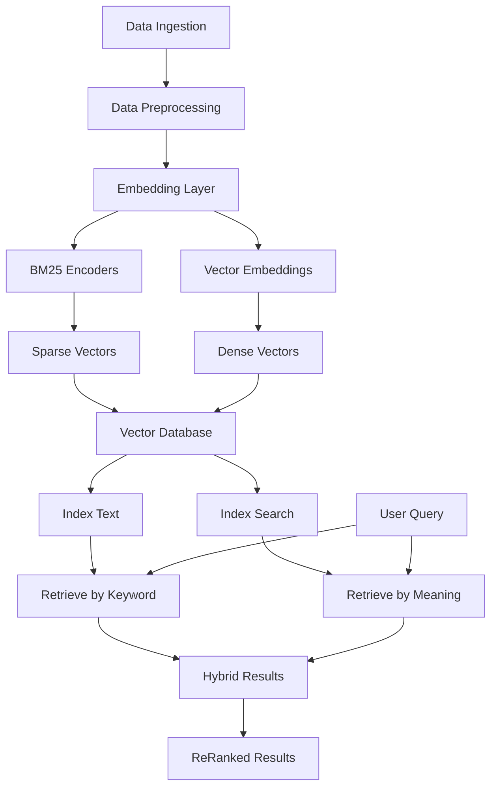

# Intelligent Internal Knowledge Assistant

## Overview
This project is an intelligent knowledge assistant that unifies scattered organizational knowledge across multiple platforms (PDFs, text documents, Slack, images, videos) into a centralized queryable interface. Leveraging Natural Language Processing (NLP) and Hybrid Retrieval-Augmented Generation (RAG), it provides contextually relevant answers with metadata through a conversational interface.

## Key Features
- **Multi-source Ingestion**: Processes PDFs, text files, Slack messages, images (OCR), and videos (speech-to-text)
- **Hybrid Retrieval**: Combines BM25 keyword search and semantic vector embeddings
- **Metadata-rich Responses**: Returns source documents with contextual metadata
- **Modular Architecture**: Extensible tools for different data sources
- **Conversational Agent**: LangGraph-powered interface with Groq LLM

## System Architecture


## Workflow Explanation
1. **Data Ingestion**: Accepts multiple formats (PDFs, text, Slack, images, videos)
2. **Preprocessing**:
   - Text extraction (PyPDF, Tesseract OCR, speech-to-text)
   - Document chunking with metadata preservation
3. **Embedding Layer**:
   - Dual-path processing (sparse + dense vectors)
   - BM25 for keyword indexing
   - HuggingFace embeddings for semantic meaning
4. **Vector Database** (Pinecone):
   - Stores hybrid vectors
   - Enables efficient similarity searches
5. **Query Processing**:
   - Parallel sparse+dense retrieval
   - Results fusion and reranking
   - Metadata-enriched responses

## Modules
| Module | Function | Key Technologies |
|--------|----------|------------------|
| `pdf_tool.py` | PDF processing | PyPDFLoader, Pinecone |
| `document_loader.py` | Text processing | TextLoader, Recursive Splitter |
| `slack.py` | Message retrieval | Slack SDK, BM25 Encoding |
| `video.py` | Speech-to-text | MoviePy, SpeechRecognition |
| `ocr.py` | Image processing | OpenCV, Tesseract |
| `index.ipynb` | Main interface | LangGraph, ChatGroq LLM |

## Quick Start
```bash
# 1. Clone repository
git clone https://github.com/yourrepo/knowledge-assistant.git
cd knowledge-assistant

# 2. Setup environment
python -m venv .venv
source .venv/bin/activate
pip install -r requirements.txt

# 3. Configure environment variables
echo "PINECONE_API=your_api_key" >> .env
echo "GROQ_API=your_api_key" >> .env

# 4. Launch Jupyter
jupyter lab index.ipynb
```

## Query Examples
```python
# PDF query
"Who are the authors of 'Attention Is All You Need'?"

# Slack search
"Show recent discussions about API deadlines"

# Video content
"What technical concepts were mentioned in the project video?"
```

## Sample Response
```json
[
  {
    "content": "Provided proper attribution is provided, Google hereby grants permission...",
    "metadata": {
      "source": "attention.pdf",
      "page": 0
    }
  },
  {
    "content": "Ashish Vaswani, Noam Shazeer et al.",
    "metadata": {
      "source": "Slack",
      "channel": "research-papers"
    }
  }
]
```

## License
MIT License - See [LICENSE](LICENSE) for details